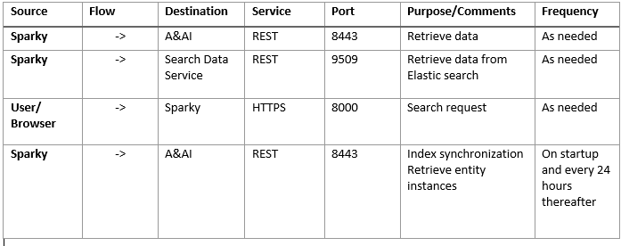

Architecture
============
Sparky Architecture in AAI
===========================
The Sparky microservice is built on a spring platform. The table below highlights Sparky's interaction with various microservices that exist in the AAI ecosystem.
.. _architecture:

