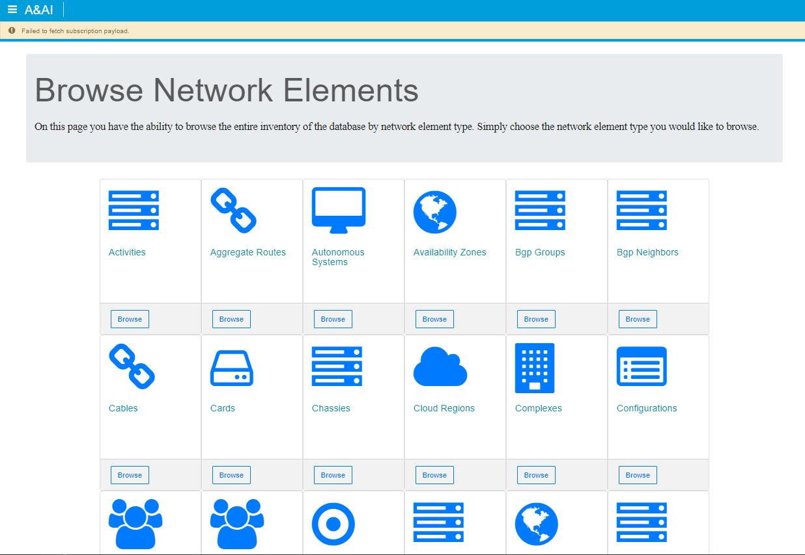
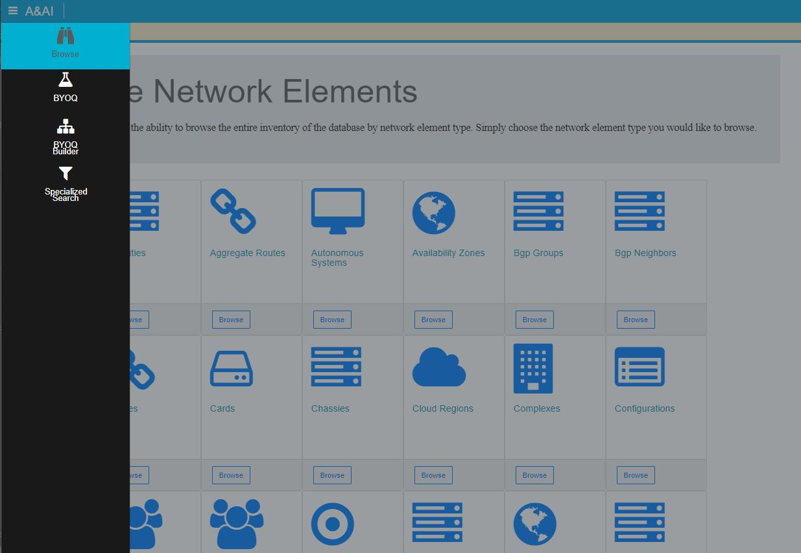
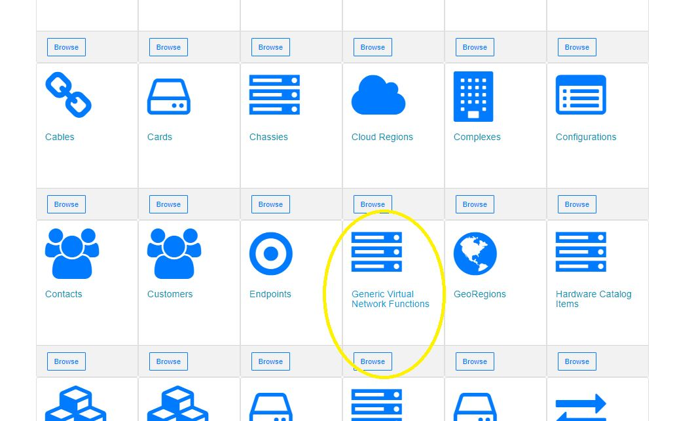
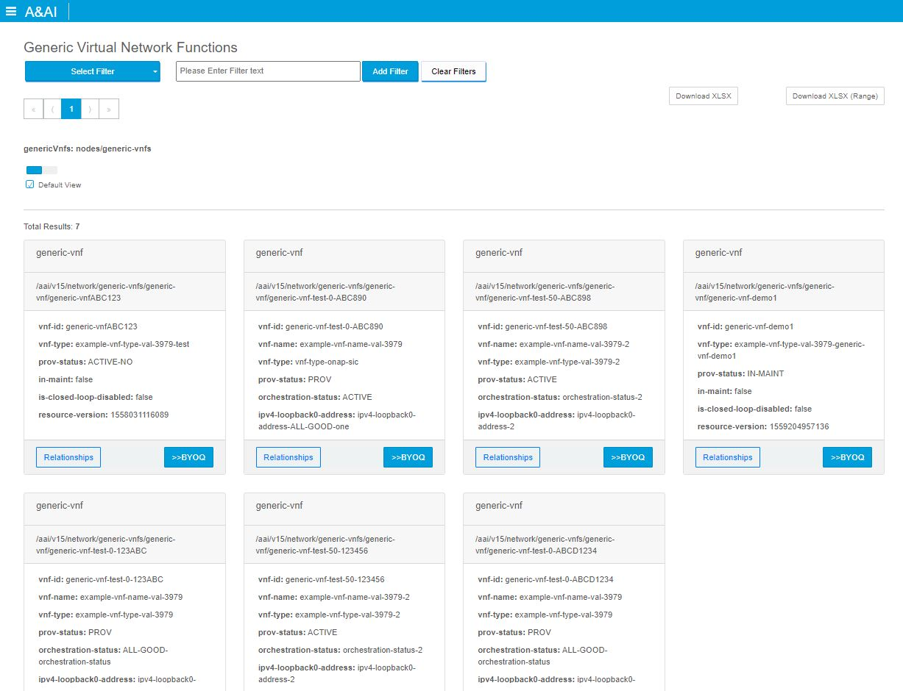
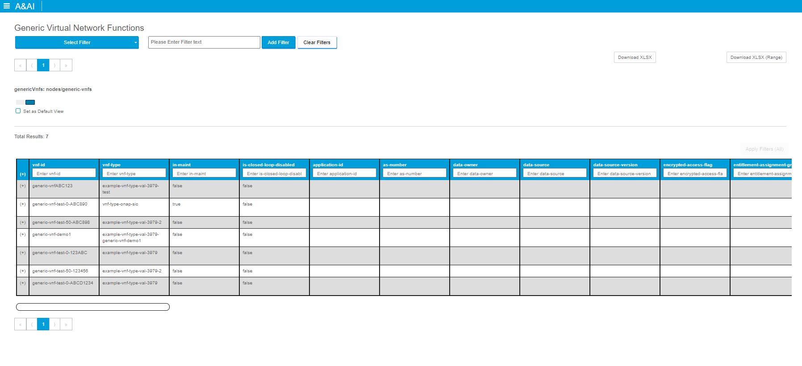
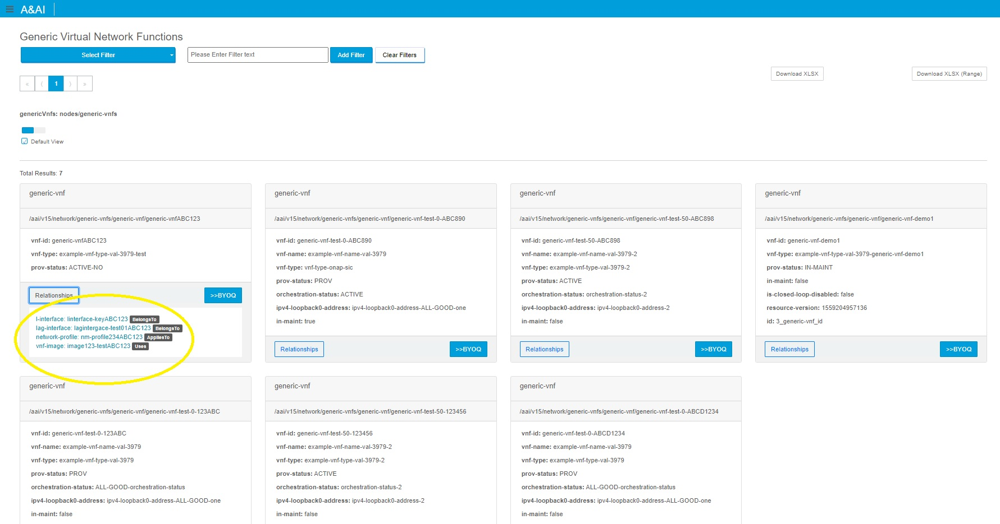
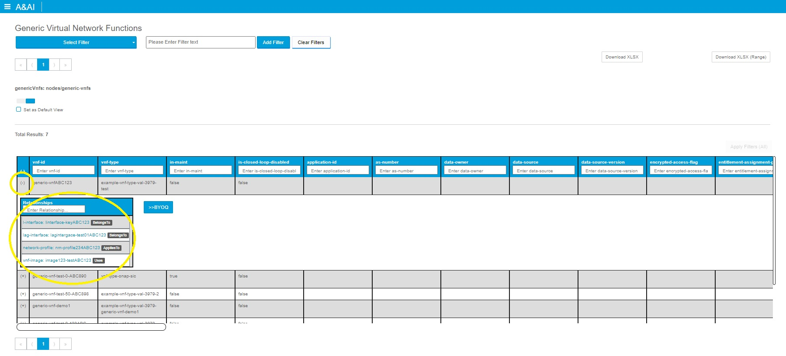
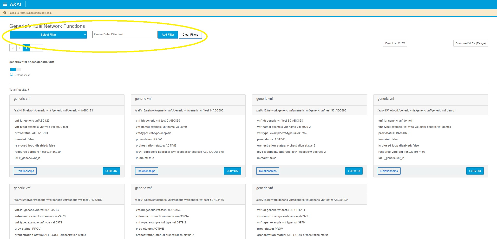
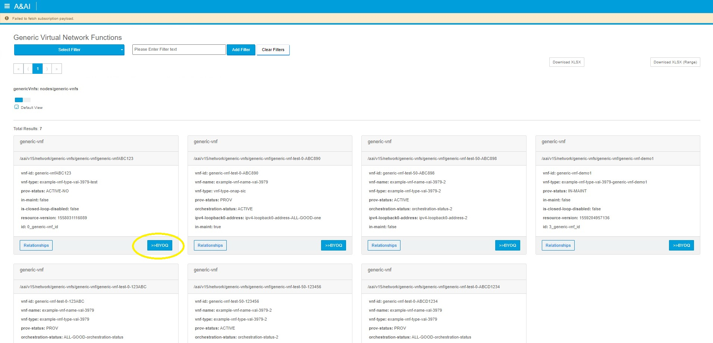
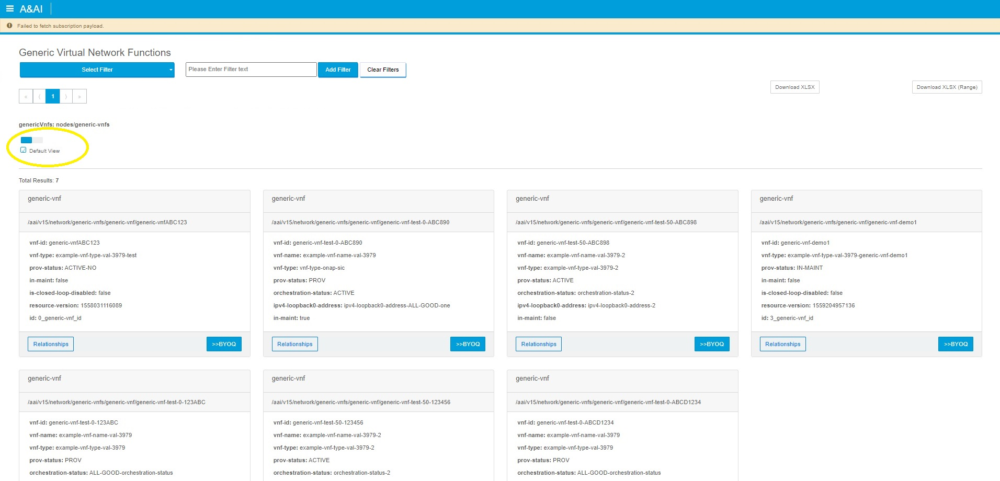

.. This work is licensed under a Creative Commons Attribution 4.0 International License.

Sparky - Browse
=======================

*Browse* Overview
~~~~~~~~~~~~~~~~~~~~~~~~~

*Browse* provides a way to easily browse the inventory items in A&AI

*Browse* Features
~~~~~~~~~~~~~~~~~~~~~~~~~
With Browse UI, users can:
  * Click on a tile for a configured node-type and view the instance data
  * The user can view the information on the subsequent page in a paginated format (50 results per page)
  * The user can filter down the results by attributes on the top of the page (exact string matching only)
  * The user can download their results to xslx (500 results at a time)
  * The user can opt to download a range of pages to download to xslx
  * The user can view results in card-based format
  * The user can view results in a tabular-based format
  * The user can choose a defaulted format (saved in local storage)
  * The user can view & traverse relationships of an element
  * The user can build a query giving the element and all related elements (1 hop) by clicking >>BYOQ

Navigation to *Browse*
~~~~~~~~~~~~~~~~~~~~~~~~~~~~~~

The *Browse* view can be reached by clicking on the Browse icon from the hamburger menu

How to use *Browse*
~~~~~~~~~~~~~~~~~~~~~~~~~~~
1. On the Browse page click a desired node type to view, in this case I chose generic virtual network functions

2. On the resulting page you can see the results in card format

3. Or in tabular format

4. A user could view the relationships of an element on the card format by clicking the relationships button,

Clicking a relationship will traverse that relationship to the item

5. A user could view the relationships of an element on the tabular format by clicking the + to expand the row

Clicking a relationship will traverse that relationship to the item

6. A user could filter their results by adding filters at the top of the screen

6. A user could build a query giving the element and all related elements (1 hop) by clicking >>BYOQ

7. A user could switch between view types using the blue and grey buttons here, they can also set their default view here

