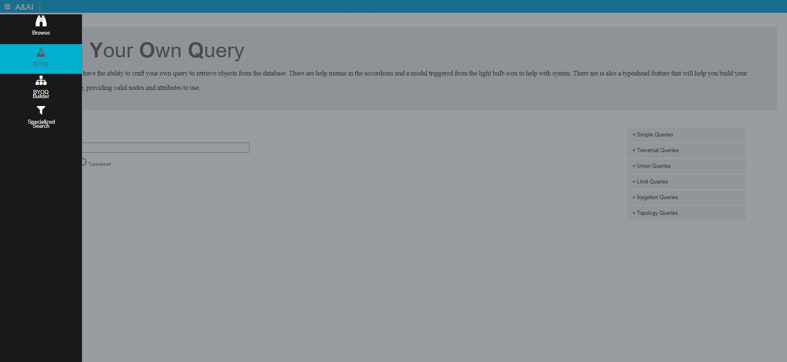
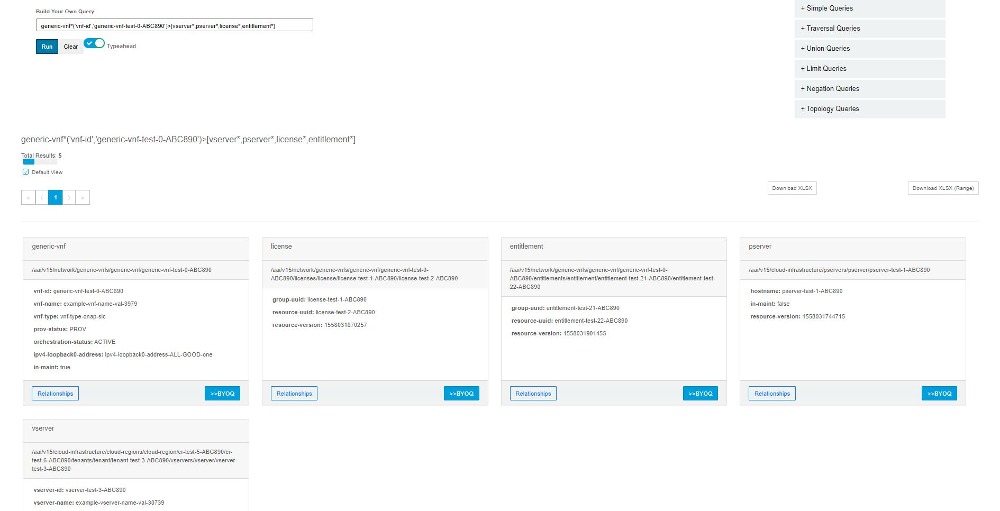
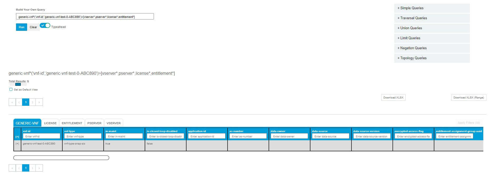
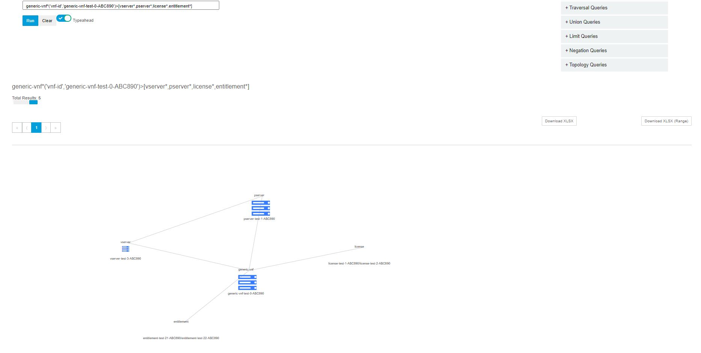
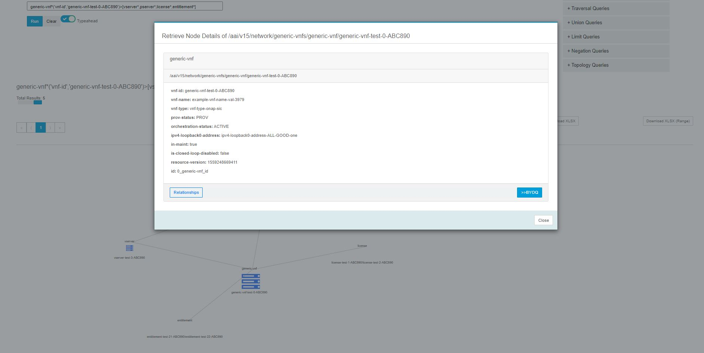
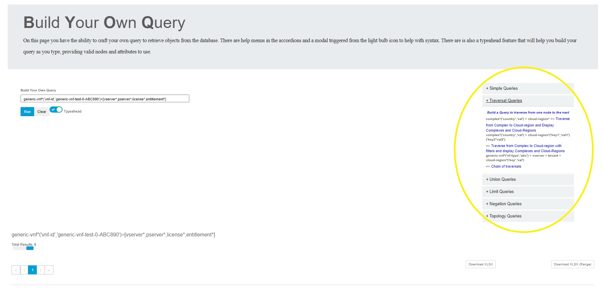

.. This work is licensed under a Creative Commons Attribution 4.0 International License.

Sparky - BYOQ
=======================

*BYOQ* Overview
~~~~~~~~~~~~~~~~~~~~~~~~~

*BYOQ* provides a way for users to build their own traversal queries in A&AI

.. image:: images/aai-ui-byoq.jpg
   :scale: 100 %
   :alt: alternate text
   :align: center

*BYOQ* Features
~~~~~~~~~~~~~~~~~~~~~~~~~
With BYOQ UI, users can:
  * Create queries to extract information using typeahead help functionality
  * The user can view help menus on the DSL syntax
  * The user can view the information in a paginated format (50 results per page)
  * The user can filter down the results in the tabular view on the column headers (exact string matching only)
  * The user can download their results to xslx (500 results at a time)
  * The user can opt to download a range of pages to download to xslx
  * The user can view results in card-based format
  * The user can view results in a tabular-based format
  * The user can view results in a visual format
  * The user can pinch/zoom in the visual format and double click on the elements to get additional info in a modal
  * The user can choose a defaulted format (saved in local storage)
  * The user can view & traverse relationships on an element
  * The user can build a query giving the element and all related elements (1 hop) by clicking >>BYOQ

Navigation to *BYOQ*
~~~~~~~~~~~~~~~~~~~~~~~~~~~~~~

The *BYOQ* view can be reached by clicking on the BYOQ item in the hamburger menu

How to use *BYOQ*
~~~~~~~~~~~~~~~~~~~~~~~~~~~
1. On the BYOQ page click in the dsl query input box and start creating a query

Typeahead will help with creating connections or filters as the query is being typed out (it can be configured off)

In this case I started from a generic-vnf with a specific filter and selected a few elements directly connected to it
and ran the query

The results can be seen below in card format

2. We have the option to view the output in tabular format

3. As well as visual graph format

4. You can pinch/zoom & drag/drop in the visual view and double clicking an item brings up its details in a modal

5. The user can access the syntax help documentation from the accordions

