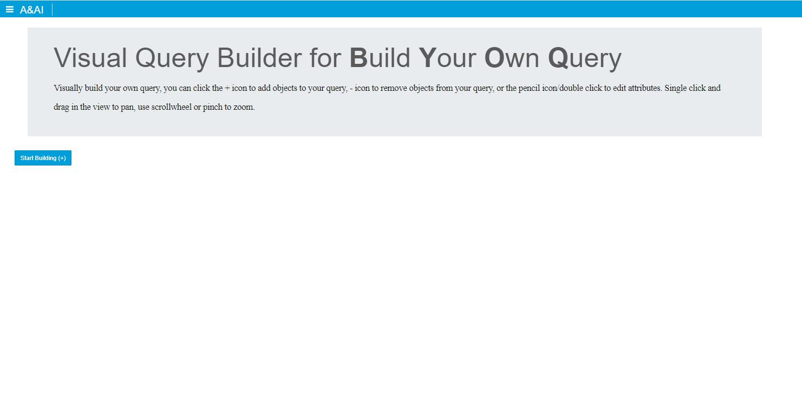
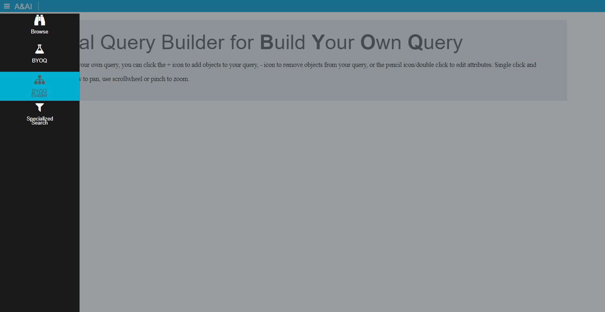
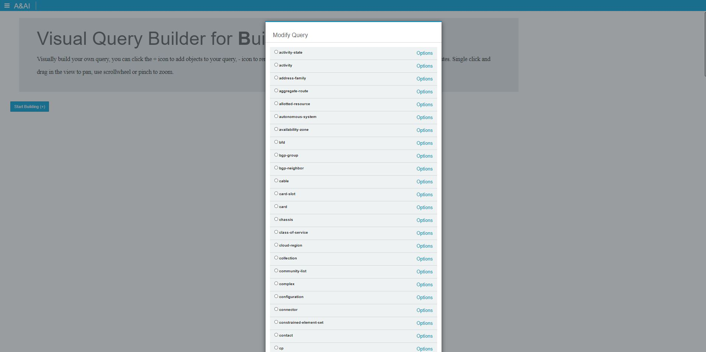
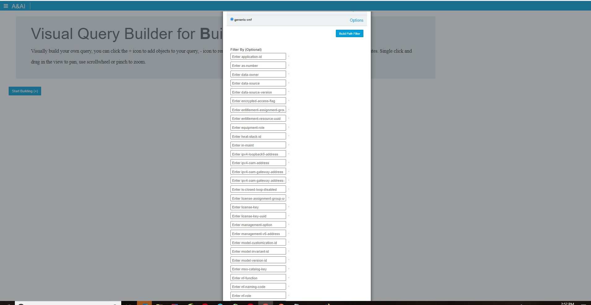
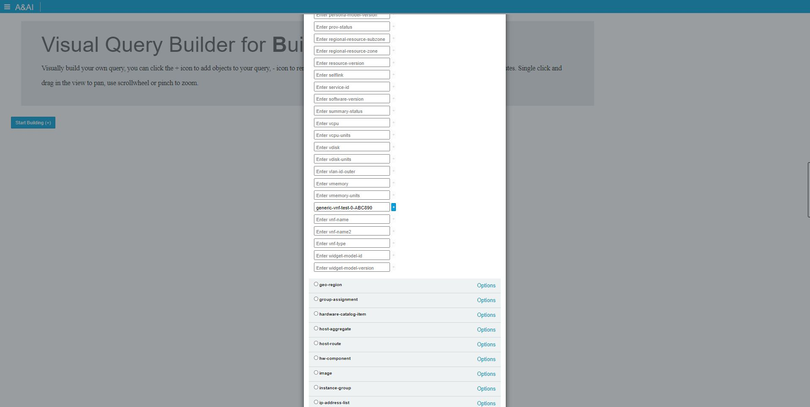
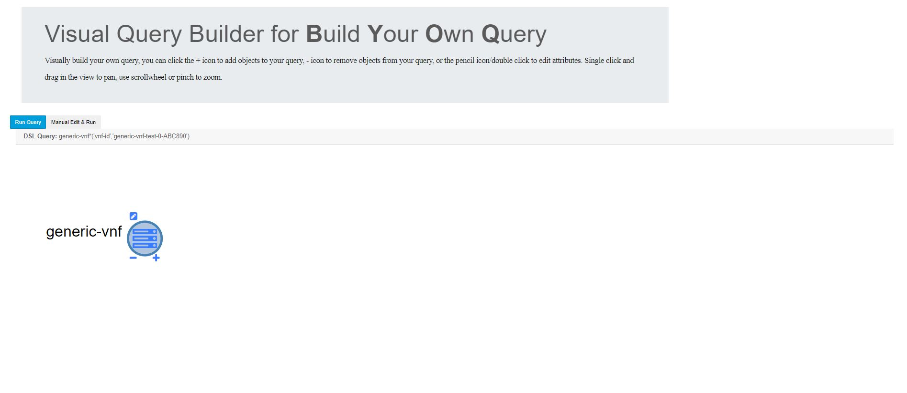
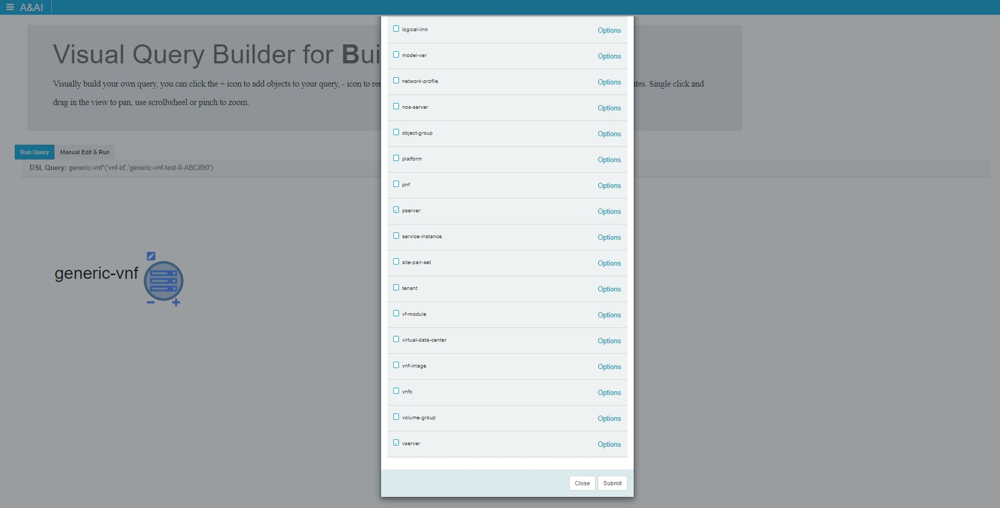
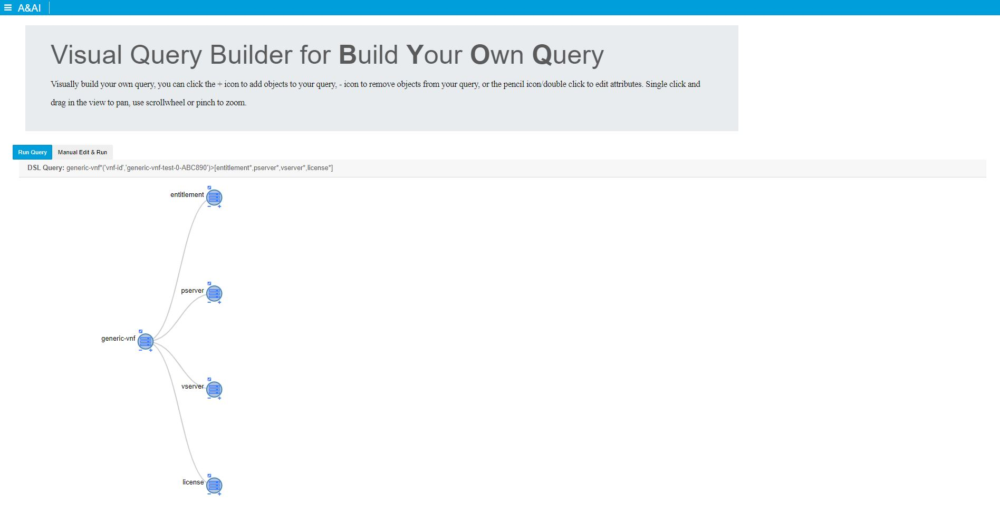
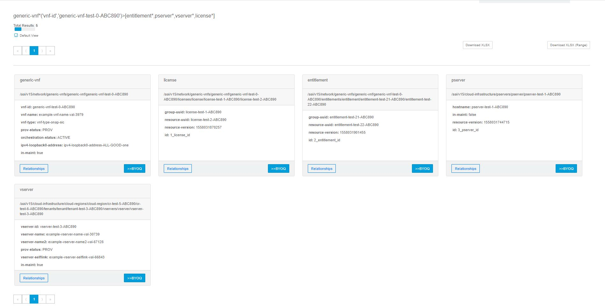
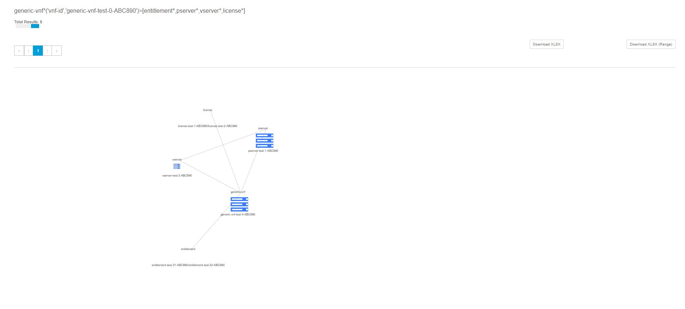

.. This work is licensed under a Creative Commons Attribution 4.0 International License.

Sparky - BYOQ Builder
=======================

*BYOQ Builder* Overview
~~~~~~~~~~~~~~~~~~~~~~~~~

*BYOQ Builder* provides a way to easily create complex queries through a visual builder

*BYOQ Builder* Features
~~~~~~~~~~~~~~~~~~~~~~~~~
With BYOQ Builder UI, users can:
  * Click on a tile for a configured node-type and view the instance data

Navigation to *BYOQ Builder*
~~~~~~~~~~~~~~~~~~~~~~~~~~~~~~

The *BYOQ Builder* view can be reached by clicking on the BYOQ Builder hamburger menu item

How to use *BYOQ Builder*
~~~~~~~~~~~~~~~~~~~~~~~~~~~
1. On the BYOQ Builder page click 'Start Building' to open the modal with all node types, to choose a starting node for your query

2. In this example I chose generic-vnf and decided to filter on one of it's properties by clicking options and entering a filter

The little blue + box allows for adding OR filter values (but I don't use it here)

3. Scroll the modal to the bottom and click submit, you will see the element you chose and a DSL query being built

4. From here you can add, remove, or edit via the icons on the node, in this case I choose + for add check a few more nodes in my query path

5. After submitting that I can see the query being built at the top and it showing the same visually

6. You can continue this process of adding/deleting/editing and adding filters until you have the final query for your desired output.

At this point you would click Run Query or Manually Edit and Run Query if you want to make manual edits.

After this is done, your qury will be ran and results returned.

