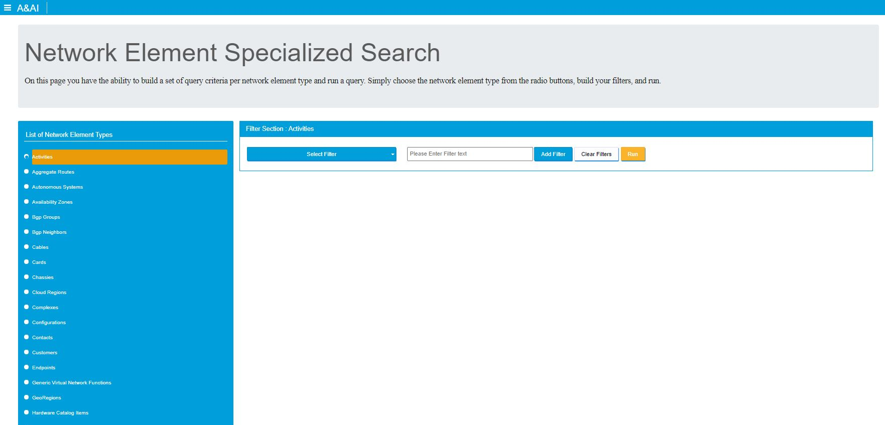
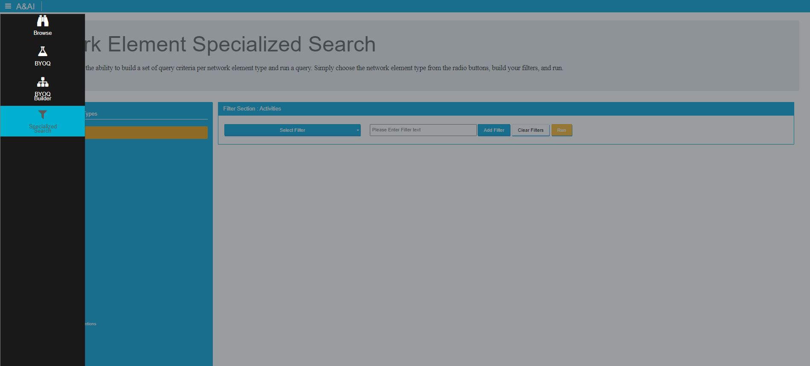
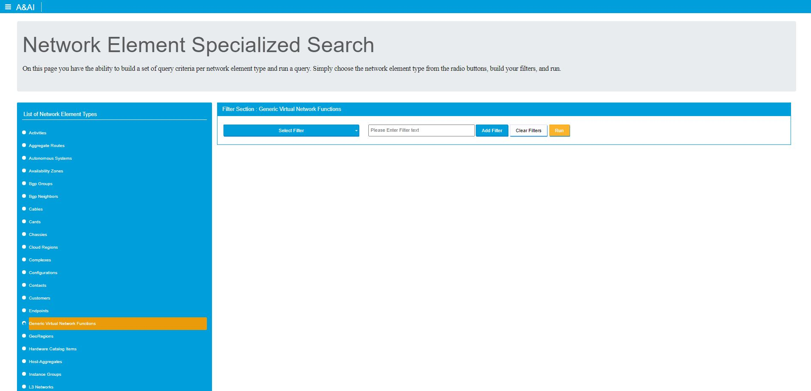
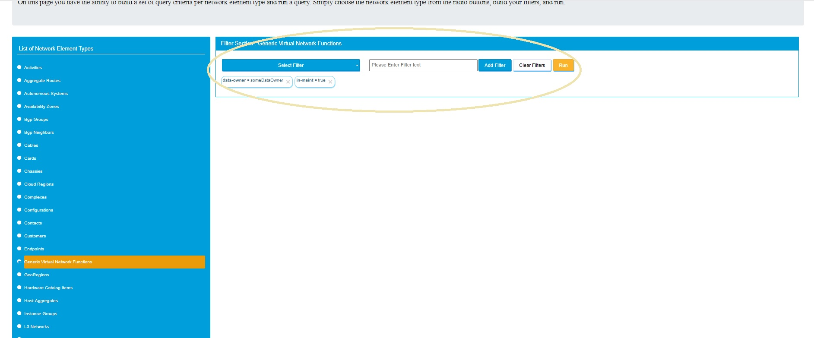

.. This work is licensed under a Creative Commons Attribution 4.0 International License.

Sparky - Specialized Search
===========================

*Specialized Search* Overview
~~~~~~~~~~~~~~~~~~~~~~~~~~~~~

*Specialized Search* provides a way to easily filter the inventory items in A&AI

*Specialized Search* Features
~~~~~~~~~~~~~~~~~~~~~~~~~~~~~
With Specialized Search UI, users can:
  * Click on a radio button for a configured node-type and add filters to run and view instance data
  * The user can view the information on the subsequent page in a paginated format (50 results per page)
  * The user can filter down the results by attributes on the top of the page (exact string matching only)
  * The user can download their results to xslx (500 results at a time)
  * The user can opt to download a range of pages to download to xslx
  * The user can view results in card-based format
  * The user can view results in a tabular-based format
  * The user can choose a defaulted format (saved in local storage)
  * The user can view relationships of an element
  * The user can build a query giving the element and all related elements (1 hop) by clicking >>BYOQ

Navigation to *Specialized Search*
~~~~~~~~~~~~~~~~~~~~~~~~~~~~~~~~~~

The *Specialized Search* view can be reached by clicking on the hamburger menu item Specialized Search

How to use *Specialized Search*
~~~~~~~~~~~~~~~~~~~~~~~~~~~~~~~
1. On Specialized Search a user can select an element type

2. Then add the desired filter(s) with the input fields in the center, by choosing the attribute key from the dropdown,
entering a value and clicking add filter. Once the filter is added it will be present as a pill. Filters can be removed
by clicking the X on the pill

3. When the desired filters are added, a user can hit run to access the results. The subsequent page will be the same as
the resulting page in the browse documentation, just with the filters added. For more information on that screen, please
view the documentation on browse.

