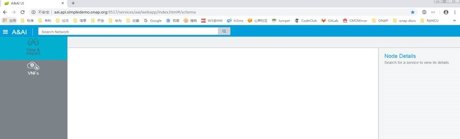
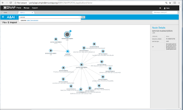
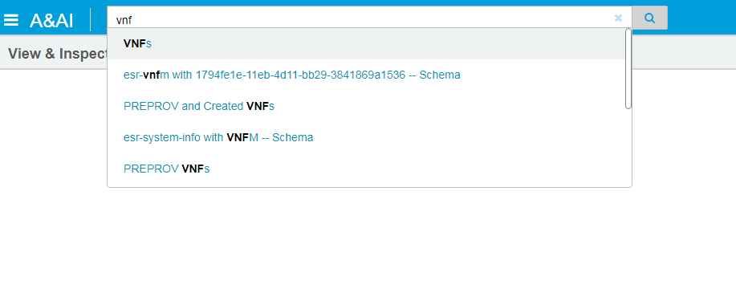
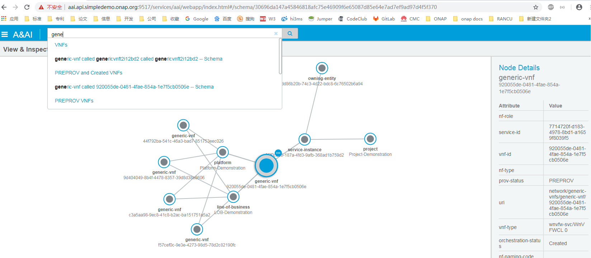
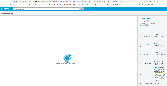
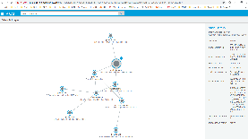

.. This work is licensed under a Creative Commons Attribution 4.0 International License.

Sparky - View & Inspect
=======================

*View & Inspect* Overview
~~~~~~~~~~~~~~~~~~~~~~~~~

*View & Inspect* provides a graph based view of elements within AAI. A
single entity is the entry point into each graph, and from that base
element a graph is generated based off relationships.

*View & Inspect* Features
~~~~~~~~~~~~~~~~~~~~~~~~~
With View & Inspect UI, users can:
  * Search for a network or service object using any part of a key  attribute name, ID or object type
  * Select a node matching suggestion returned in the drop-down list, and view a visual representation of its service hierarchy and related nodes
  * View and search for multiple object types
  * View the specific attributes of a node or any of its related nodes

Navigation to *View & Inspect*
~~~~~~~~~~~~~~~~~~~~~~~~~~~~~~

The *View & Inspect* view can be reached by two means:

1. Main navigation menu
2. Selecting a search result related to an entity instance (e.g. an
   entity called readme-entity)

Using *View & Inspect*
~~~~~~~~~~~~~~~~~~~~~~

*View & Inspect* is driven by using the search bar at the top of the UI
to find and select entity instances. Once an instance has been selected,
a request is processed in *Sparky's* backend component that generates a
graph representation of the selected entity. The graph data is returned
to *View & Inspect* and rendered on screen.

Node Details
^^^^^^^^^^^^

Upon node selection, the selected graph node details will appear in a
panel to the right of the graph titled, *Node Details*.

Interacting with the Graph
~~~~~~~~~~~~~~~~~~~~~~~~~~

The graph can be panned by clicking and holding empty space amongst the
graph and moving the mouse. This will pan the entire graph. The graph
can be zoomed in and out by using a mouse scroll wheel. Nodes in the
graph can be select by clicking on them. Nodes in the graph can be moved
by clicking, holding, and dragging them using the mouse.

How to use *View & Inspect*
~~~~~~~~~~~~~~~~~~~~~~~~~~~
1. Start typing into the "Search Network" bar and search suggestions will be displayed - as below

Note: The OXM schema defines the services and resources archetypes and mappings to Java types that are used by A&AI to define the REST endpoints for reading and manipulating the inventory data. The OXM file has been annotated with searchable attributes. Sparky communicates with Synapse (data-router) to update ElasticSearch as entities are created/updated and deleted.

The related objects are displayed as a graph. The attributes of the selected object are in the "Node Details" tab beside the graph display

