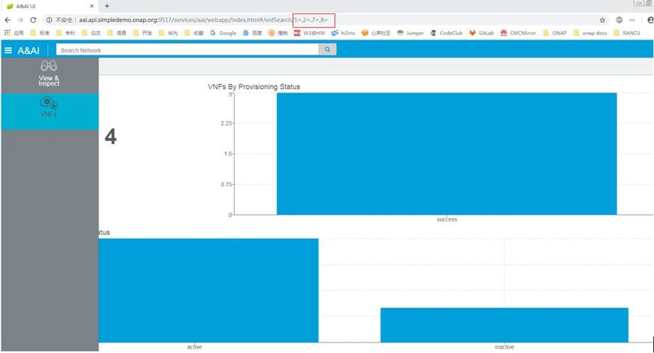

.. This work is licensed under a Creative Commons Attribution 4.0 International License.

Sparky - VNFs
==============

*VNFs* Overview
~~~~~~~~~~~~~~~

*VNFs* is an aggregation-based view that provides aggregate counts of
VNFs based off of provisioning status and orchestration status.

*VNFs* Features
~~~~~~~~~~~~~~~
With VNFs UI, users can:
   * Search for generic-vnfs by attribute value(s) specified in the search box using suggested search terms.
   * View search results aggregated to display:
      - A count of the total VNFs returned by the search
      - A count of the VNFs for each prov-status values.
   * Filter out data to reduce the amount of data displayed to the user. Users can  filter data based on:
       - Orchestration status
       - Provisioning status
       - Network function type
       - Network function role

Navigation to *VNFs*
~~~~~~~~~~~~~~~~~~~~

1. Main navigation menu
2. Selecting a search result related to an aggregation result (e.g. and
   VNFs)

Using *VNFs*
~~~~~~~~~~~~

*VNFs* is driven by using the search bar at the top of the UI to find
and select aggregation queries. Once selected, the aggregation queries
will be sent to the *Sparky* backend component for processing. When a
result set has been determined *VNFs* will render the data - as below:

Note: The OXM schema defines the services and resources archetypes and mappings to Java types that are used by A&AI to define the REST endpoints for reading and manipulating the inventory data. The OXM file has been annotated with suggestible attributes. Sparky communicates with Synapse (data-router) to update ElasticSearch as entities are created/updated and deleted.

